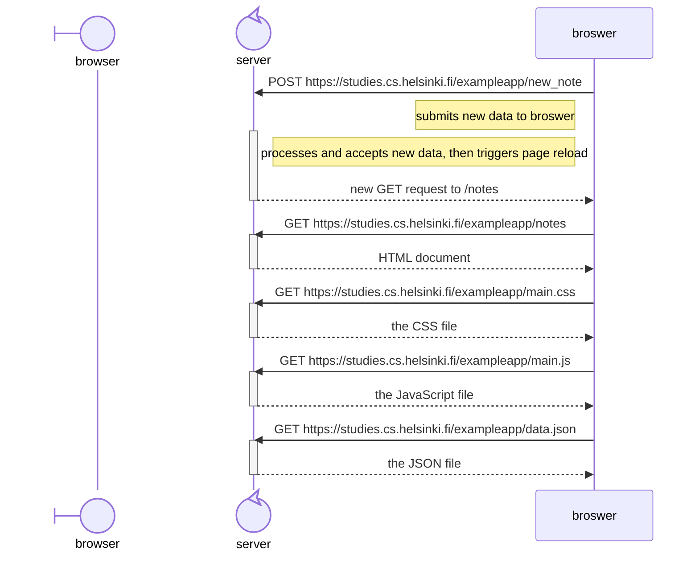

```mermaid
sequenceDiagram
    participant browser@{ "type" : "boundary" }
    participant server@{ "type" : "control" }

    broswer->>server: POST https://studies.cs.helsinki.fi/exampleapp/new_note
    Note left of broswer: submits new data to broswer
    activate server
    Note right of server: processes and accepts new data, then triggers page reload
    server-->>broswer: new GET request to /notes
    deactivate server

    broswer->>server: GET https://studies.cs.helsinki.fi/exampleapp/notes
    activate server
    server-->>broswer: HTML document
    deactivate server

    broswer->>server: GET https://studies.cs.helsinki.fi/exampleapp/main.css
    activate server
    server-->>broswer: the CSS file
    deactivate server

    broswer->>server: GET https://studies.cs.helsinki.fi/exampleapp/main.js
    activate server
    server-->>broswer: the JavaScript file
    deactivate server

    broswer->>server: GET https://studies.cs.helsinki.fi/exampleapp/data.json
    activate server
    server-->>broswer: the JSON file
    deactivate server
```