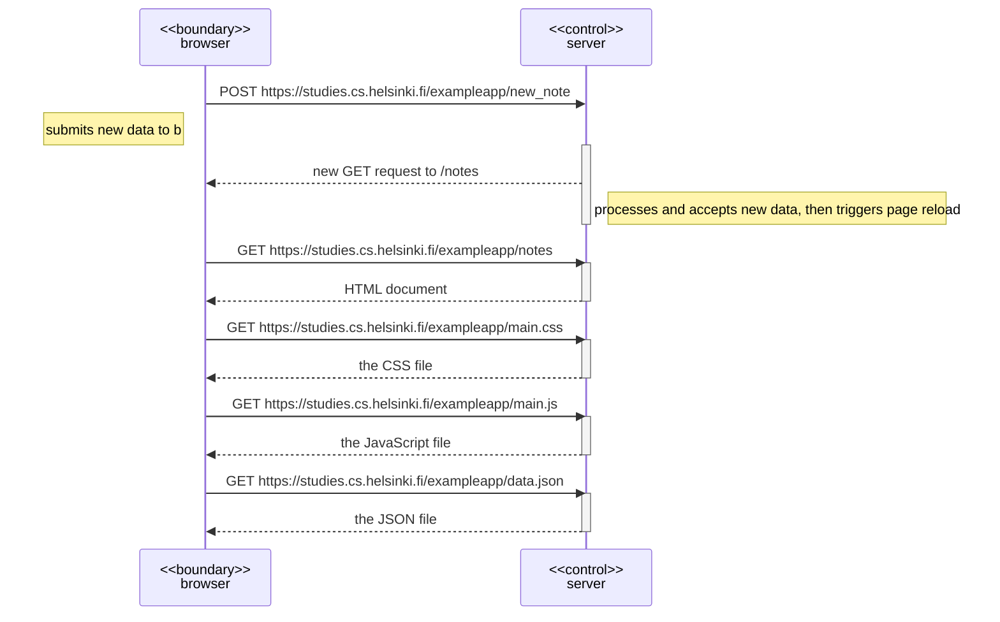

```mermaid
sequenceDiagram
    participant b as <<boundary>><br>browser
    participant s as <<control>><br>server

    b->>s: POST https://studies.cs.helsinki.fi/exampleapp/new_note
    Note left of b: submits new data to b
    activate s
    s-->>b: new GET request to /notes
    Note right of s: processes and accepts new data, then triggers page reload
    deactivate s

    b->>s: GET https://studies.cs.helsinki.fi/exampleapp/notes
    activate s
    s-->>b: HTML document
    deactivate s

    b->>s: GET https://studies.cs.helsinki.fi/exampleapp/main.css
    activate s
    s-->>b: the CSS file
    deactivate s

    b->>s: GET https://studies.cs.helsinki.fi/exampleapp/main.js
    activate s
    s-->>b: the JavaScript file
    deactivate s

    b->>s: GET https://studies.cs.helsinki.fi/exampleapp/data.json
    activate s
    s-->>b: the JSON file
    deactivate s
```