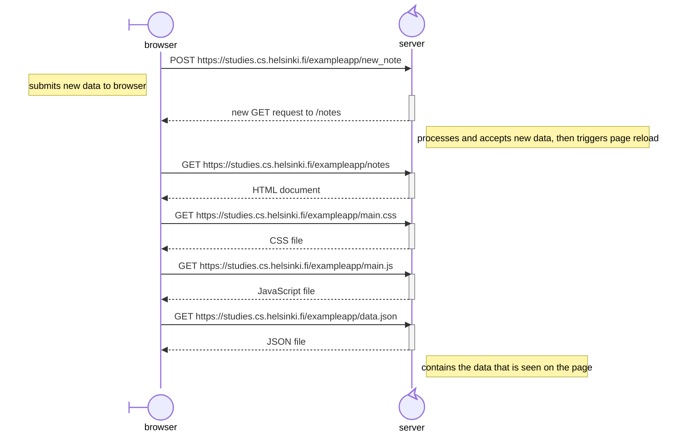

```mermaid
sequenceDiagram
    participant browser@{ "type" : "boundary" }
    participant server@{ "type" : "control" }

    browser->>server: POST https://studies.cs.helsinki.fi/exampleapp/new_note
    Note left of browser: submits new data to browser
    activate server
    server-->>browser: new GET request to /notes
    deactivate server
    Note right of server: processes and accepts new data, then triggers page reload

    browser->>server: GET https://studies.cs.helsinki.fi/exampleapp/notes
    activate server
    server-->>browser: HTML document
    deactivate server

    browser->>server: GET https://studies.cs.helsinki.fi/exampleapp/main.css
    activate server
    server-->>browser: CSS file
    deactivate server

    browser->>server: GET https://studies.cs.helsinki.fi/exampleapp/main.js
    activate server
    server-->>browser: JavaScript file
    deactivate server

    browser->>server: GET https://studies.cs.helsinki.fi/exampleapp/data.json
    activate server
    server-->>browser: JSON file
    deactivate server
    Note right of server: contains the data that is seen on the page
```