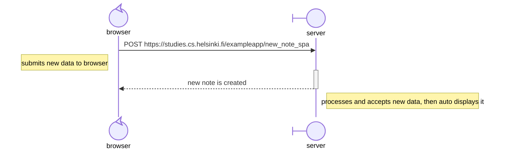

```mermaid
sequenceDiagram
    participant browser@{ "type" : "control" }
    participant server@{ "type" : "boundary" }

    browser->>server: POST https://studies.cs.helsinki.fi/exampleapp/new_note_spa
    Note left of browser: submits new data to browser
    activate server
    server-->>browser: new note is created
    deactivate server
    Note right of server: processes and accepts new data, then auto displays it
```